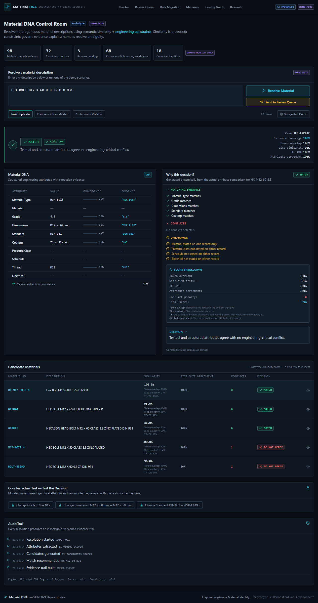
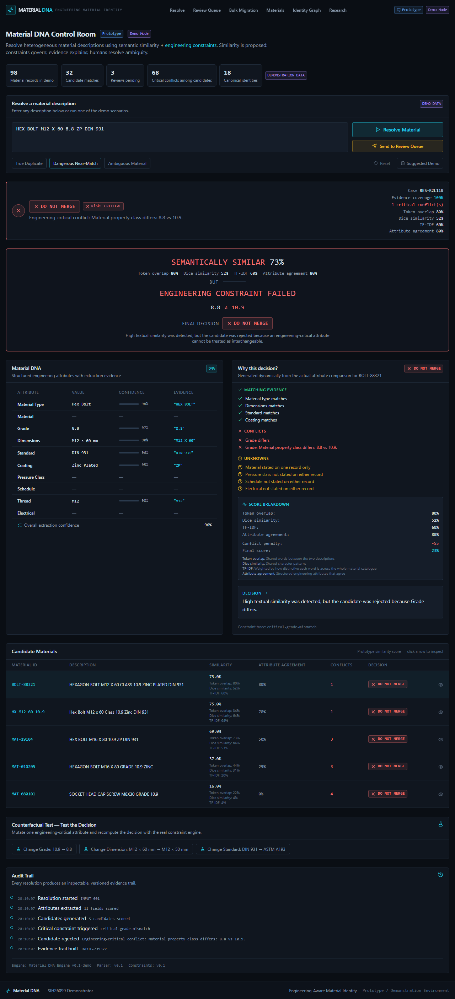
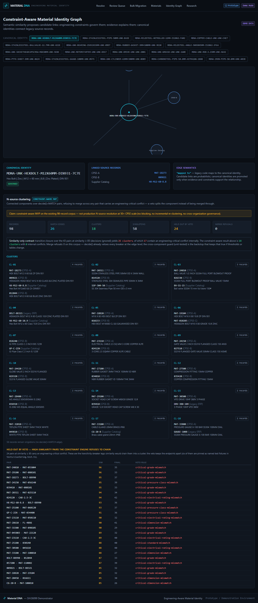
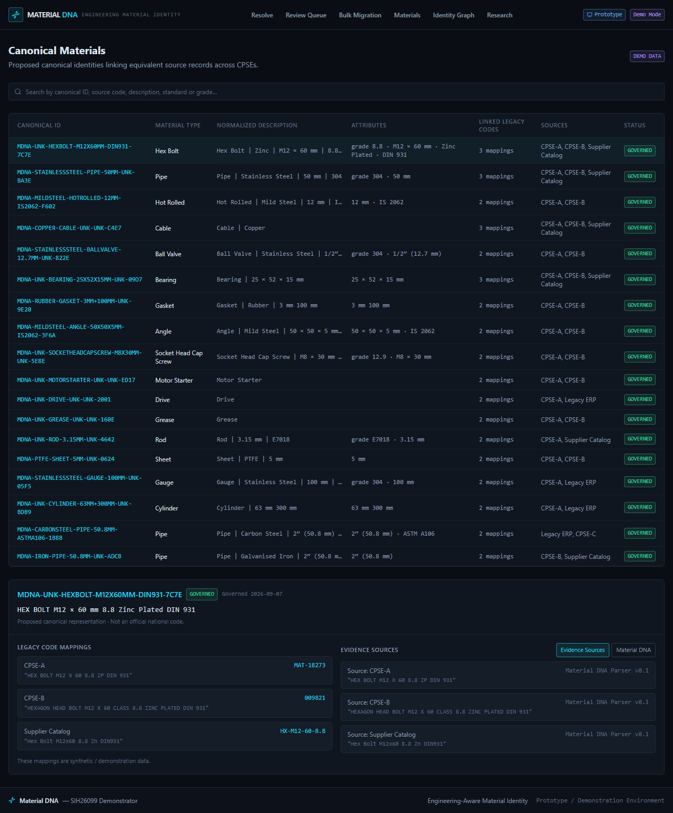
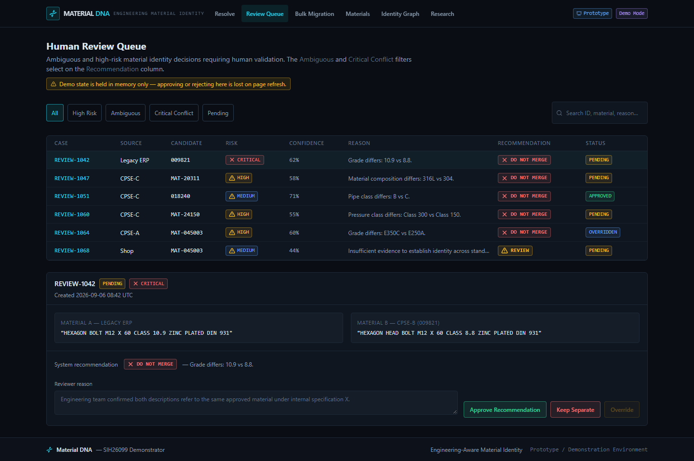
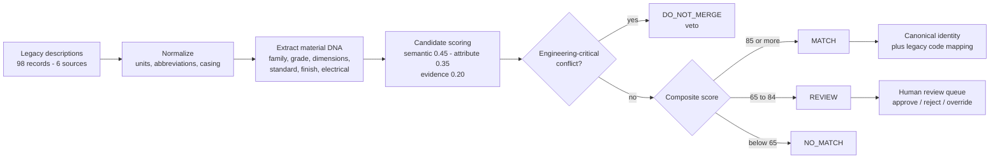

<div align="center">

# Material DNA

### AI-Driven Standardization and Harmonization of Material Codes Across CPSEs

**Smart India Hackathon 2026 · Problem Statement [PS26099](https://www.sih.gov.in/)**
Ministry of Petroleum &amp; Natural Gas

[](https://material-dna.vercel.app/)
[](./LICENSE)
[](https://nextjs.org/)
[](https://react.dev/)
[](https://www.typescriptlang.org/)

[**Open the live demo →**](https://material-dna.vercel.app/) · [**Browse the code →**](https://github.com/kathir-iTech/material-dna)

</div>

---

**Material DNA** takes free-text industrial material descriptions from different CPSEs and legacy
ERP exports, works out the *engineering meaning* of each one, and decides — pair by pair — whether
they describe the same physical material or must be kept apart.

It is built around one idea that generic deduplication tools get wrong:

> **A high similarity score is not evidence that two records are the same material.**
> Two descriptions can be almost word-for-word identical and still be incompatible fasteners.
> So similarity is only ever allowed to **rank** candidates. The **decision** belongs to
> engineering constraints.

That is what the demo's second button is for — the *same* sentence, run twice:

| Input | Corpus candidate | Verdict |
| --- | --- | --- |
| `HEX BOLT M12 X 60 8.8 ZP DIN 931` | CPSE-B record, grade **8.8** | **MATCH** |
| `HEX BOLT M12 X 60 8.8 ZP DIN 931` | Legacy ERP record, grade **10.9** | **DO_NOT_MERGE** |

Identical text. Different property class. Merging them would mis-specify the bolt's torque rating —
so the engine refuses, and shows the conflicting attribute as the reason.



---

## Screenshots

| | |
| --- | --- |
|  |  |
| **`/` · the veto.** Same input as the left neighbour, but the nearest candidate is grade 10.9 — blocked. | **`/graph` · constraint-aware clusters.** 18 identities from 98 records; 24 high-similarity pairs held out by the veto instead of merged. |
|  |  |
| **`/materials` · canonical identities** and the legacy codes each one absorbs. | **`/review` · human-in-the-loop queue.** Every AI verdict a human can approve, reject, or override — with an audit note. |

---

## The problem

CPSEs under the Ministry of Petroleum & Natural Gas maintain large spare-part inventories in
disconnected ERP/SAP masters. The same physical bolt exists under a different code, a different
naming convention and a different unit of measure in every organisation. Consequences:

- duplicate and near-duplicate material masters,
- descriptions that cannot be compared between organisations,
- shared or aggregated procurement becomes impossible to search,
- and nobody can tell a genuine duplicate from an engineering mismatch.

PS26099 asks for a **National Unified Material Master Framework** that matches descriptions across
CPSEs, standardises them, recommends a common code, keeps the mapping to each original code, and
supports human approval plus SAP/ERP integration.

## What this repository actually does

It is a working, end-to-end slice of the **decision core** — the part that is genuinely hard and
that everything else depends on. It runs entirely on CPU with no database and no external services.



Four verdicts — `MATCH`, `DO_NOT_MERGE`, `REVIEW`, `NO_MATCH` — from three composable stages under
`src/lib/material-dna/`:

- **extraction** — unit and abbreviation normalisation, then attribute parsers for thread,
  dimensions, grade/property class, included items, coating and electrical ratings, plus a
  precedence-aware material-type classifier (scoped patterns first, token rules as fallback).
- **matching** — per-candidate scoring (`semantic 0.45 / attribute 0.35 / evidence 0.20`), where
  similarity fuses lexical, character-n-gram, TF-IDF and (server-side only) an optional dense
  embedding signal at weight `0.15`. An **assignment rank** orders true duplicates ahead of
  look-alikes so a near-miss grade never outranks the real match.
- **decision** — critical-constraint evaluation runs *first and independently* of score. Any
  critical conflict (grade, dimensions, material type, electrical rating) returns `DO_NOT_MERGE`
  regardless of similarity. Thresholds: `MATCH ≥ 85`, `REVIEW ≥ 65`, `NO_MATCH` below, and fewer
  than 3 defined attributes always abstains to `REVIEW`.

Clustering is **constraint-aware**: candidate edges above the review threshold are unioned, but a
vetoed pair refuses the merge instead of merging *through* it — which is what stops a
similarity-only chain from fusing three records where the outer two are incompatible.

---

## Coverage against the eight PS26099 capabilities

Status is against the code in this repository, not against intent. **Partial** means the
demonstrable path works but the production requirement is not met.

| # | PS26099 capability | Status | Evidence in this repo |
| --- | --- | --- | --- |
| 1 | AI-based matching of descriptions | **Covered** | `src/lib/material-dna/matching/` — scoring, constraint veto, assignment rank; `/api/resolve`, `/api/resolve-batch` |
| 2 | Standardization & intelligent classification | **Partial** | Attribute + type extraction is real (`extraction/`), but there is **no** mapping to an external taxonomy (UNSPSC / MESC / NATO codification is not implemented) |
| 3 | Duplicate / near-duplicate / equivalent detection | **Covered** | `matching/clustering.ts` — 18 identities over 98 records, 24 vetoed pairs held out, transitive chains broken by constraints |
| 4 | Common National Material Code | **Partial** | Structured `MDNA-…` canonical IDs are generated (`canonical-id.ts`), but they are **prototype labels, not an official national code** — no gazette/NIC authority exists here |
| 5 | CPSE code mapping & legacy migration | **Covered** | `/migrate` bulk CSV pipeline (parse → resolve → flag → approve/rollback), `legacyMappings` per canonical identity, `/api/migrate/parse` |
| 6 | Material master dashboard & analytics | **Partial** | Corpus, cluster, conflict and benchmark statistics are computed and displayed, but only over the 98-record synthetic corpus — no persistent analytics over real data |
| 7 | Audit trail & governance | **Partial** | Every mutation appends an `AuditEvent` pinned to engine / parser / constraint versions, rendered on `/` and `/migrate` — but state is in-memory: no persistence, no RBAC, no sign-off |
| 8 | SAP / ERP integration | **Not built** | No connector exists. `Legacy ERP` is only a *source name* in synthetic seed data |

---

## Measured results

### 200-pair labelled benchmark

Reproducible harness in [`benchmark/bench.ts`](./benchmark/bench.ts); recorded reference outputs in
[`expected-baseline.txt`](./benchmark/expected-baseline.txt) and
[`expected-embed.txt`](./benchmark/expected-embed.txt); methodology in
[`baseline-2026-09-29.md`](./benchmark/baseline-2026-09-29.md). Pairwise: A as input, B as the sole
candidate, confusion matrix over decided pairs (`REVIEW` counts as an abstention).

| Metric | Lexical only | Dense signal fused |
| --- | --- | --- |
| Precision (`MATCH`) | 0.800 | 0.803 |
| Recall (`MATCH`) | 0.825 | 0.828 |
| **F1 (`MATCH`)** | **0.813** | **0.815** |
| Abstentions (`REVIEW`) | 70 / 200 (35.0%) | 70 / 200 (35.0%) |
| `DO_NOT_MERGE` verdicts | 64 | 64 (**identical set**) |
| Veto precision (on true non-matches) | 84.4% (54 / 64) | 84.4% (54 / 64) |
| False vetoes (true matches blocked) | 10 | 10 |

The dense signal deliberately changes **ranking only**: the vetoed set and the false-veto count are
identical in both columns. That is the design invariant, and it is asserted in
`tests/embedding-signal.test.ts`.

### Corpus (`src/lib/material-dna/dataset-stats.ts`, `matching/clustering.ts`)

| Measure | Value |
| --- | --- |
| Records | 98 |
| Sources | 6 — CPSE-A 32, CPSE-B 27, CPSE-C 19, Supplier Catalog 10, Legacy ERP 9, Shop 1 |
| Canonical identities / clusters | 18 |
| Records placed in a cluster | 40 |
| `MATCH` edges | 26 |
| Held-out (vetoed) proposals | 24 |
| Cluster size distribution | 15 pairs, 2 triples, 1 quad, **0 singletons** |
| Candidate links (score ≥ review threshold) | 32 |
| Critical conflicts correctly blocked | 68 |
| Seeded review cases | 6 (4 pending) |
| Tests | **150** across 7 files |

> **Benchmark input.** The 200 labelled pairs are committed at
> [`benchmark/data/material-pairs-labeled.csv`](./benchmark/data/material-pairs-labeled.csv), so the
> figures above are reproducible from a fresh clone with `npm run bench` — no external files and no
> environment variables. Point `BENCH_CSV` elsewhere to score a different labelled set. The
> `expected-*.txt` files are the recorded outputs of the committed run.

---

## Stack

Everything here is real and in use — no service is listed that the app does not actually run.

| Layer | Choice | Note |
| --- | --- | --- |
| Framework | Next.js 15.5 (App Router) · React 19 | 6 pages, 7 API routes; static where possible |
| Language | TypeScript 5.7, `strict` | `npm run typecheck` is clean |
| Styling | Tailwind CSS 4 + `lucide-react` | No component library |
| Retrieval | Own TF-IDF + character-n-gram, optional `@xenova/transformers` embeddings | Embeddings are **server-side only**, weight `0.15`, ranking-only |
| Constraints | Hand-authored critical-attribute rules | Grade, dimensions, material type, electrical rating |
| Spreadsheet I/O | SheetJS `xlsx` | Client-side CSV/XLSX import for `/migrate` |
| Tests | Vitest 3 (150 tests, 7 files) | `npm test` |
| Lint / types | ESLint 9 (`next lint`) · `tsc --noEmit` | Both clean |
| Deploy | Vercel | `DEPLOYMENT.md` |
| Database / auth / queue | **none** | Deliberately — see Limitations |

## Quick start

```bash
npm install
npm run dev            # http://localhost:3000
```

Verification (all four were run against this tree):

```bash
npm test               # 150 passed (7 files)
npm run lint           # No ESLint warnings or errors
npm run typecheck      # tsc --noEmit, clean
npm run build          # production build, 7 prerendered routes + 7 API routes
```

Node 20+. No environment variables are required to boot. `TRANSFORMERS_CACHE` is optional.

## Repository layout

```
app/
  src/
    app/                        6 pages (/, /review, /migrate, /materials, /graph, /research)
                                7 API routes
    components/                 resolve, review, migration, materials, graph, audit-timeline, ui/
    data/demo.ts                synthetic 98-record corpus + scenarios
    hooks/                      use-resolver, use-review-queue, use-migration
    lib/material-dna/
      extraction/ normalization/ matching/ constraints/ demo/
      config.ts grade-equivalence.ts canonical-id.ts units.ts
      dataset-stats.ts clusters.ts
    types/domain.ts             shared domain model
  tests/                        7 files, 150 tests
  benchmark/                    labelled 200-pair CSV, harness, recorded reference outputs
  scripts/                      postinstall prune + Vercel output helpers
```

### API routes

All seven endpoints, with the page that exercises each one:

| Endpoint | Method | Purpose |
|---|---|---|
| `/api/resolve` | `POST` | Resolve one pair — the pipeline behind `/` |
| `/api/resolve-batch` | `POST` | Resolve a parsed CSV batch — the pipeline behind `/migrate` |
| `/api/migrate/parse` | `POST` | Validate and stage an uploaded CSV before batch resolve |
| `/api/materials` | `GET` | Canonical identity list — feeds `/materials` and `/graph` |
| `/api/materials/[id]` | `GET` | One identity with its linked legacy records and sources |
| `/api/canonical` | `GET` | Canonical graph and per-identity lineage — feeds `/graph` |
| `/api/reviews` | `GET` | Seeded review queue snapshot — feeds `/review` |

---

## Limitations — what is *not* here

Stated plainly, because a judge should not have to discover these by reading the source.

- **No SAP/ERP integration.** PS26099 capability 8 is not implemented at all. `Legacy ERP` is a
  source *label* in seed data, not a connector.
- **No database, auth, or persistence.** Review queue and migration state are in-memory module
  state. **A page refresh loses every decision.** There is no multi-user story, no RBAC, no
  sign-off, and the audit trail cannot be replayed after a restart.
- **The corpus is synthetic.** 98 hand-written descriptions. **No real CPSE or MESC data has been
  used**, so the benchmark measures the engine against labels derived from the same synthetic
  generator — treat F1 0.813 as an engineering regression baseline, not as real-world accuracy.
- **The 200-pair benchmark is not reproducible from a fresh clone** without supplying the labelled
  CSV yourself (see the caveat above).
- **No external taxonomy.** Canonical IDs are internal labels; there is no UNSPSC / MESC / NATO
  mapping and no official national code authority.
- **Scoring is hand-tuned, not learned.** Thresholds and weights are fixed constants in
  `config.ts`. There is no trained model and no calibration against real data.
- **The interactive Resolve page runs without the dense signal.** Embeddings are downloaded
  server-side only, to avoid a ~22 MB model download in the browser. `/migrate` does use them.
- **Scaling is untested.** The corpus pass is O(n²) over 98 records and is computed in-process.
  PS26099 is national scale; this would need blocking, ANN indexing and a real datastore first.

## License

MIT — see [LICENSE](./LICENSE).

> **Prototype disclaimer.** Built for SIH 2026. All catalog records, review cases and canonical
> identities are synthetic. Colour is used semantically only (green / amber / red / cyan, always
> paired with an icon and a text label). Labels such as "Proposed canonical identity" are prototype
> labels and **not official national codes**. Nothing here is production authority.